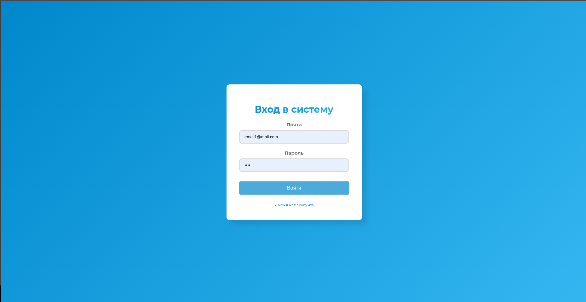
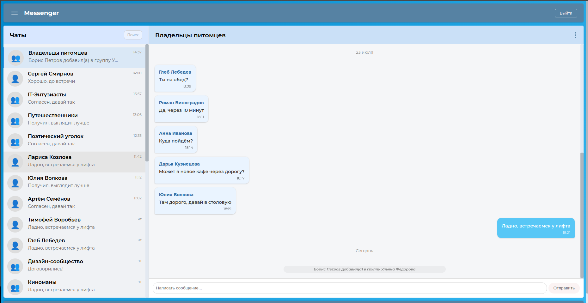
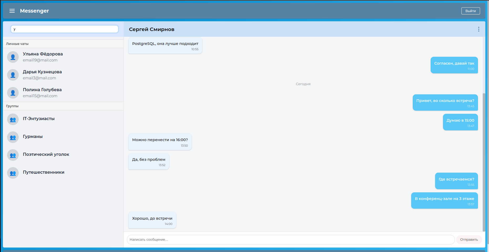
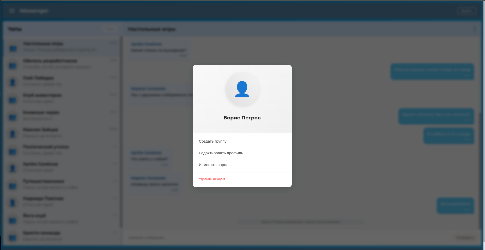

# Messenger Frontend MVP

## 📌 Overview

This is a minimum viable product (MVP) of a messenger application featuring:

- **Backend**: Companion server + Full API reference (REST endpoints, WebSocket protocol) - [GitHub Repository](https://github.com/dz1kill/backend_messenger)
- **Frontend**: React-based interface with REST API + JWT auth for user management and WebSocket API for real-time messaging

## ✨ Core Features

### 🔌 WebSocket Connection

#### 💬 Chats & Groups

- 📜 Paginated loading of private chats
- 📜 Paginated loading of group chats

#### ✉️ Messaging

- 📜 Paginated loading of private messages
- 📜 Paginated loading of group messages
- ✈️ Send private messages
- ✈️ Send group messages

#### 🛠 Group Management

- ➕ Create new groups
- 👥 Add new members to groups
- 🚪 Leave group
- ❌ Delete group
- ℹ️ System notifications (member joins/leaves)

### 🌐 HTTP API

#### 🔐 Authentication

- 📝 User registration
- 🔑 Login
- 🔄 Password change
- 🗑 Account deletion

#### 👤 User Profile

- ✏️ Edit personal information

#### 🔍 Search

- 👤 User search
- 🔎 Find users and groups I'm member of
- ➕ Find users to add to groups

#### 🗂 Chat Management

- ❌ Delete conversation

## 🛠 Technical Stack

### Frontend Core

- **React** - UI framework
- **Redux Toolkit** - State management
- **React Router DOM** - Client-side routing

### Real-Time Communication

- **WebSocket API** - Real-time messaging
- **React-use-websocket** - WebSocket integration

## 🖼️ Interface Screenshots

### 1. Authorization

<details>  
  <summary>🔍 Show screenshot</summary>  
    
</details>

### 2. Chat

<details>  
  <summary>🔍 Show screenshot</summary>  
    
</details>

### 3. Search

<details>  
  <summary>🔍 Show screenshot</summary>  
    
</details>

### 4. Settings

<details>  
  <summary>🔍 Show screenshot</summary>  
    
</details>

## 🏃 Running the app

```bash
# Replace the API URLs in the .env file with those matching your network.

# Running the project in development mode:
$ npm run start

```
